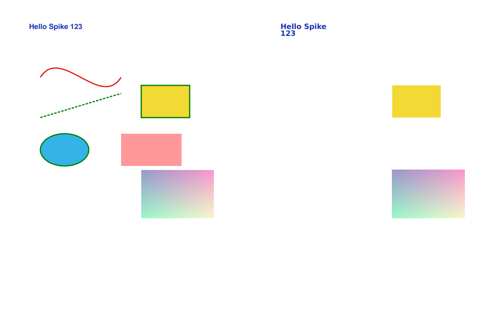

# Open-source evaluation

The brief was explicit: do not write a conversion engine from scratch before
checking whether one exists. This document records what was examined, what was
actually run, and why the project ended where it did. Every claim below comes
from reading the source or running the code — not from a README.

Evaluation date: 2026-09-01. Environment: Linux x86-64, Node 22.22.2,
Python 3.11.15, LibreOffice 24.2 (Impress), PDFium via pypdfium2 5.13.0.

## Summary

| Candidate | Licence | Ran it? | Verdict |
|---|---|---|---|
| **GenOffice** `packages/pdf2docx` + `pptx-engine` | Apache-2.0 | Yes — built, ran its suite, converted a probe PDF | **Rejected as the engine.** Its PPTX path emits only text boxes, axis-aligned rects, pictures and uniform-bordered tables; curves, diagonals, ellipses, strokes and alpha are dropped, and the loss is silent. |
| LibreOffice PDF import | MPL-2.0 | Yes — used as the PPTX renderer | **Kept as a tool, not an engine.** Excellent renderer for the verification step; its PDF *import* targets Draw, not a PowerPoint object model. |
| mu-pdf-converter / PyMuPDF-based tools | AGPL-3.0 or commercial | No — licence gate | **Rejected before code review.** Not usable without a licence decision the operator has not made. |
| MinerU2PPT | unclear at the time of review | No — licence gate | **Rejected for reuse.** Ideas noted; no code taken. |
| Whole-page PNG/SVG/EMF exporters | various | n/a | **Out of scope by definition** — they produce a picture of a page, which is what this project exists to avoid. |
| **Plan B: pdfminer.six + pypdfium2 + python-pptx + lxml** | MIT / BSD-3 / MIT / BSD-3 | Yes — this repository | **Adopted.** |

## 1. GenOffice (primary hypothesis)

- Repository: `https://github.com/genspark-ai/genoffice`
- Commit examined: **`3548a808170616c2b13b1dc7c6c81cb49205d504`** (shallow clone of
  the default branch, 2026-09-01)
- Licence: Apache-2.0 (`LICENSE`), `NOTICE` names Mainfunc, Inc. The `ee/`
  directory was not read or used.
- Modules read in full: `packages/pdf2docx/src/rebuild-pptx/{index,rebuild,table,text}.ts`,
  `packages/pdf2docx/src/{ir,pipeline}.ts`, `packages/pdf2docx/src/analyze/{shapes,vector}.ts`,
  `packages/pptx-engine/src/insert.ts`, `apps/shell/src/main/pdf2pptx-local.ts`.

### What it actually builds

`npm install --ignore-scripts` at the workspace root, then
`npx vitest run rebuild-pptx` in `packages/pdf2docx`: **7 tests, all passing**.
The package is real, maintained and tested — this is not a dead repository.

A probe PDF was then converted through its own public entry point
(`convertPdfToPptx`, driven by a temporary test that loads the PDFium wasm the
way its test helpers do). The probe contained seven objects: one line of text,
a stroked cubic Bézier, a dashed diagonal line, a filled **and stroked**
rectangle, a filled+stroked ellipse, a 40 %-alpha rectangle, and a JPEG.

The produced `ppt/slides/slide1.xml` contained exactly **three** shapes:

```
Counter({'p:sp': 2, 'a:prstGeom': 2, 'p:pic': 1, 'a:blip': 1})
```

- one `rect` — the yellow fill, **with its stroke dropped**
- one text box — text correct, font substituted, wrapped onto two lines
- one picture — and `ppt/media/` held **`image1.png`**, i.e. the source **JPEG
  was decoded and re-encoded**

Silently missing: the Bézier curve, the dashed diagonal, the ellipse, the
translucent rectangle, and the rectangle's stroke. No warning, no report entry.



The source PDF for that comparison is committed as
`docs/assets/poc-spike-source.pdf`.

### Why the source says this is structural, not a bug

1. **Curves are discarded at extraction.** `packages/pdf2docx/src/ir.ts` defines
   a subpath as `points: Array<{x,y}>` plus a boolean `hasCurves`. The control
   points never enter the IR, so no downstream stage can emit
   `a:cubicBezTo`. Meeting the brief's "preserve `cubicBezierTo` losslessly"
   would mean rewriting the extraction layer, not adding a writer.
2. **The vector strategy is rasterisation by design.**
   `packages/pdf2docx/src/analyze/vector.ts` opens with: *"Dense clusters of
   such subpaths over text-sparse areas become regions the EXTRACTION layer
   rasterizes via PDFium."* Curves and diagonals are the trigger for a raster
   region, not for a shape.
3. **The PPTX writer has no shape vocabulary.**
   `rebuild-pptx/rebuild.ts` emits exactly four things: `addPicture`,
   `addElement({kind:'textbox'})`, `addElement({kind:'rect'})` and
   `buildTableGridXml`. `PageShapes` (ir.ts) models only axis-aligned `Fill`s and
   horizontal/vertical `Stroke`s, and counts everything else as `ignoredPaths`.
4. **Table borders are uniform by construction.**
   `rebuild-pptx/table.ts` sets one border spec for the whole table
   (`scope: 'all' | 'insideV'`, a fixed `LATTICE_BORDER_PT = 0.75`), and
   `pptx-engine/src/insert.ts`'s `NewTableCellSpec` has no per-edge fields at
   all. Per-cell top/bottom/left/right borders are unreachable at both layers.
5. **OCR is not wired into the PPTX path.** `convertPdfToPptx` returns
   `scannedDocument` so *the caller* can "steer the user to an OCR flow";
   `ocr.ts` / `ocr-vision.ts` are not called from it.
6. **No fidelity gate.** There is no render-compare-fallback step, so a page
   that rebuilds wrongly ships wrongly.

### Things it does better than this project

Worth recording honestly: GenOffice's layout analysis is far deeper than what
is here — column detection, zones, panels, footnotes, TOC handling, list
reconstruction, RTL/bidi, font metric fitting. If the goal had been DOCX flow
reconstruction it would be the obvious base. `pptx-engine/src/custgeom.ts`
also shows its *writer* can express custom geometry; only the PDF→PPTX path
never asks it to.

### Verdict

Rejected as the engine. Adopting it would have meant replacing the extraction
layer (to keep Bézier control points, dash, alpha and clip), replacing the PPTX
rebuild layer (to emit shapes at all), extending the table writer (per-edge
borders), and adding a verification stage — i.e. keeping the layout heuristics
and rewriting everything the brief actually asks for, inside a 70 MB Electron
monorepo. Vendoring the analysis passes remains a sensible future move under
Apache-2.0 (see `docs/decision-record.md`), and no GenOffice code is used
today.

An early note in this evaluation said GenOffice's output failed to load in
LibreOffice. That was wrong and is corrected here: the container had
`libreoffice-core` without `libreoffice-impress`, so *every* PPTX failed to
load, including a python-pptx control file. With Impress installed,
GenOffice's deck loads cleanly. Its problem is what the deck omits, not its
validity.

## 2. LibreOffice

MPL-2.0. Its PDF import produces a Draw document — a page ofvector objects aimed at
Draw's model, not a PowerPoint object model, and it does not produce native
`a:tbl` tables. It is, however, the best available **PPTX renderer** on Linux,
and this project depends on it for the verification and visual-regression
steps (see `docs/testing.md`). It is a runtime tool, not a bundled library, so
its licence does not reach our distribution.

## 3. PyMuPDF-based tools (mu-pdf-converter and similar)

PyMuPDF is AGPL-3.0 or a commercial licence from Artifex. The brief is explicit
that "internal use, not sold" does not excuse skipping the review, and no such
review has been signed off. The dependency was therefore not evaluated
further and no code was read. If the operator later obtains a licence, PyMuPDF
would be worth revisiting — its path and text extraction is more complete than
pdfminer's. See `docs/license-review.md`.

## 4. MinerU2PPT

Reviewed only for its published description of layout/OCR staging. Its
licensing was not clear enough at review time to justify reading the source
with reuse in mind, so no code was taken and none of its structure is copied.

## 5. Plan B (adopted)

| Component | Role | Licence |
|---|---|---|
| `pdfminer.six` | content-stream extraction | MIT |
| `pypdfium2` | page rendering (PDFium) | BSD-3-Clause / Apache-2.0 |
| `python-pptx` | OOXML packaging, parts and relationships | MIT |
| `lxml` | raw DrawingML construction | BSD-3-Clause |
| `Pillow` | image decode/encode | MIT-CMU (HPND) |
| `numpy` | image comparison | BSD-3-Clause |

Everything is permissive. Nothing is copyleft. The full check is in
`docs/license-review.md`.

The decisive capability test was run before writing any converter code — a
probe PDF through pdfminer's `paint_path`:

```
stroke=True fill=False lw=3.00 dash=None      segs=['moveTo', 'cubicBezierTo']
stroke=True fill=False lw=3.00 dash=([6,3],0) segs=['moveTo', 'lineTo']
stroke=True fill=True  lw=3.00                segs=['moveTo','lineTo','lineTo','lineTo','closePath']
stroke=True fill=True  lw=3.00                segs=['moveTo','cubicBezierTo' x4]
stroke=False fill=True fill_alpha=0.40        segs=['moveTo','lineTo','lineTo','lineTo','closePath']
image img0001 jpg passthrough=True            (sha256 identical to the source JPEG file)
```

Cubic control points, dash arrays, per-object alpha and byte-identical JPEG
streams all survive — the four things GenOffice's IR cannot carry. Two gaps in
pdfminer had to be closed in this repository and are documented at their call
sites: `do_gs` is a stub (constant alpha from `/ExtGState`) and `do_W` is a
stub (clip rectangles). Both are implemented in
`src/pdf2editable_ppt/extract/content.py`.

## Failure cases found during the PoC, and what was done

| Case | Symptom | Resolution |
|---|---|---|
| Rotated glyphs | `LTChar.size` is the device-space box height, so a rotated space came out 0 pt and digits shrank | point size derived from the text matrix |
| Korean + Latin on one line | phantom spaces at every script boundary | gaps measured at the pen (origin + advance), not between glyph boxes |
| Column layouts | three columns joined into one sentence | split at layout gutters and at drawn vertical rules |
| Page `/Rotate` | pages rotated twice | pdfminer already applies `/Rotate`; the pipeline now treats its output as visual space |
| Shadings (`sh`) | gradients vanished silently | `do_sh` and pattern fills recorded, then rendered as a region |
| Page-wide background rect | adopted as nine cell fills, background lost | a cell fill must be contained in the table and near the cell's own size |
| LibreOffice-authored rects/ovals | extra collinear vertices and arc-subdivided ovals became freeforms | collinear anchors dropped; ellipse recognised by fitting anchors to the inscribed ellipse |
| Text verification | glyph hinting differences read as 25 % missing ink | comparison blurs first and uses a separate text threshold profile |

## What is still unverified

- **Microsoft PowerPoint has not opened these files.** No Windows or macOS host
  was available. All rendering checks went through LibreOffice. See
  `docs/testing.md` for the manual checklist that closes this gap.
- No real company document has been converted. The corpus is synthetic. The
  numbers in `docs/testing.md` are corpus numbers and are not a claim about
  real decks.
